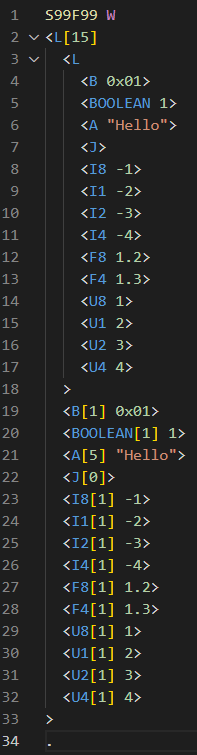

# SECS Message Language (SML) for VS Code

Adds syntax highlighting for SECS Message Language (SML), commonly used in semiconductor equipment communication (e.g., `S2F13`, `L[2]`, `U4[1] 42`).

## ✨ Features

* Highlights SECS data types: `L`, `A`, `B`, `U1`, `F8`, etc.
* Distinguishes:

  * Format codes
  * Lengths (e.g., `[2]`)
  * Values (numbers and strings)
* Supports nested brackets `<...>`

## 📦 File Support

* Recognizes `.sml` and `.secs` files
* Language ID: `sml`

## 🧹 Requirements

None — works out of the box in VS Code 1.102.0 or later.

## 🛠 Known Issues

* Folding and indentation not yet supported
* No validation or autocomplete (syntax only)

## 📜 Release Notes

### 0.0.1

* Initial release with syntax highlighting

---

**Enjoy coding in SML!**
For issues or suggestions, feel free to open an issue on GitHub.
